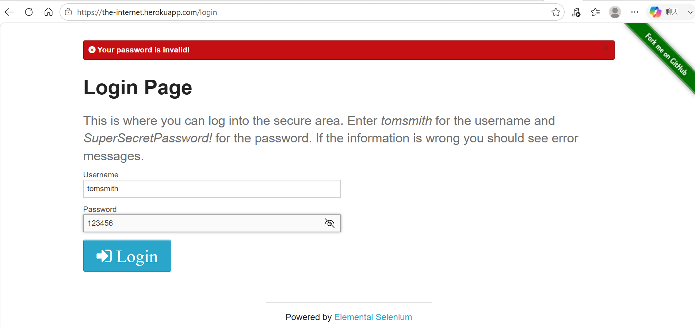
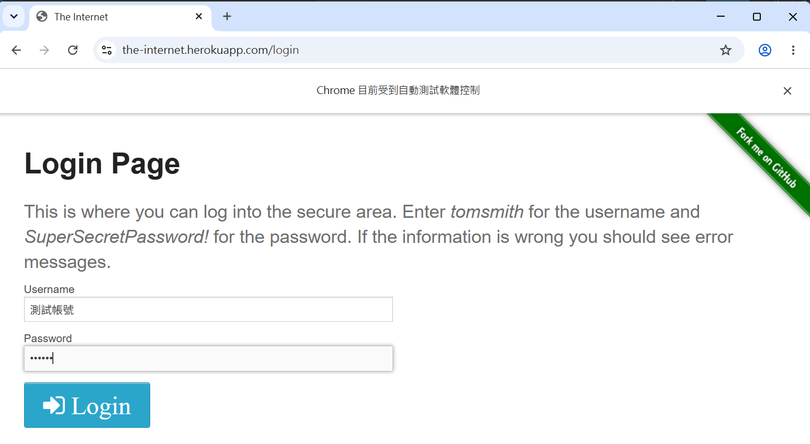
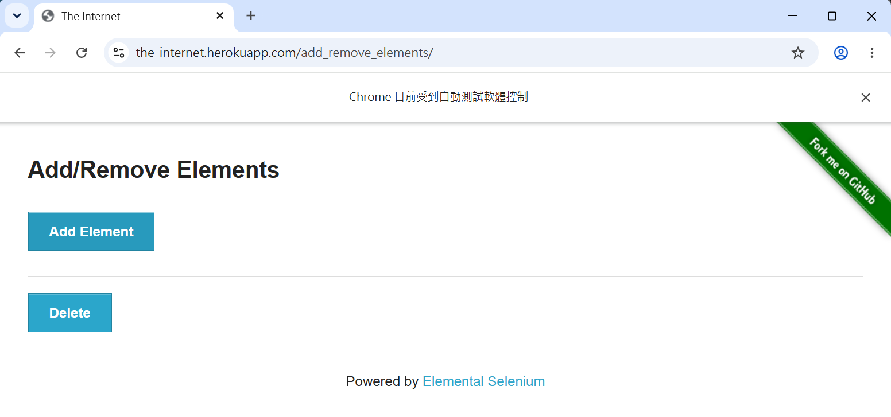
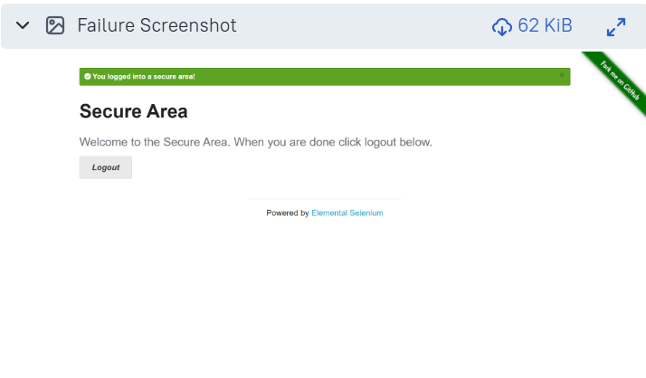

# Selenium Automation Testing Framework


A maintainable **Selenium Web UI Automation Testing Framework** built with **Python, Selenium WebDriver, Pytest, Page Object Model (POM), Allure Report, and GitHub Actions CI**.

This project demonstrates how to design a reusable Selenium automation framework with Page Objects, reusable BasePage methods, explicit waits, Pytest fixtures, automatic failure screenshots, test reporting, and continuous integration.
---

## ✨ Features

- Selenium Web UI Automation
- Pytest Test Framework
- Page Object Model (POM)
- Reusable BasePage Architecture
- Explicit Wait with `WebDriverWait`
- Reusable Selenium Actions
- Pytest Fixtures
- Assertion-Based Verification
- Automatic Failure Screenshot
- Timestamped Screenshot Naming
- Allure Test Reporting
- GitHub Actions CI
- CI Test Result Artifacts
---

## 🛠 Technologies

| Technology | Purpose |
|------------|---------|
| Python | Test automation development |
| Selenium WebDriver | Browser automation |
| Pytest | Test execution and fixtures |
| Page Object Model | Test architecture and maintainability |
| WebDriverWait | Explicit synchronization |
| Allure | Test reporting |
| GitHub Actions | Continuous Integration |
| Google Chrome | Test browser |
| Selenium Manager | WebDriver management |
| Git | Version control |

---

## 📂 Project Structure

```text
selenium-test/
│
├── .github/
│   └── workflows/
│       └── ci.yml
│
├── pages/
│   ├── __init__.py
│   ├── base_page.py
│   ├── login_page.py
│   ├── form_page.py
│   └── button_page.py
│
├── test/
│   ├── conftest.py
│   ├── test_login.py
│   ├── test_form.py
│   └── test_button.py
│
├── test-cases/
│   ├── login-test-case.md
│   └── form-test-case.md
│
├── screenshots/
│   └── .gitkeep
│
├── .gitignore
├── pytest.ini
├── requirements.txt
└── README.md
```

> Test reports, Allure results, temporary files, and generated screenshots are excluded from source control through `.gitignore`.

---

# 🏗 Framework Architecture

```text
                         GitHub Actions
                               │
                               ▼
                         Pytest Test Cases
                               │
                               ▼
                      Page Object Model
                               │
              ┌────────────────┼────────────────┐
              ▼                ▼                ▼
         LoginPage          FormPage        ButtonPage
              │                │                │
              └────────────────┼────────────────┘
                               ▼
                           BasePage
                               │
                 ┌─────────────┼─────────────┐
                 ▼             ▼             ▼
              click()      send_keys()   get_text()
                 │             │             │
                 └─────────────┼─────────────┘
                               ▼
                         Explicit Wait
                               │
                               ▼
                      Selenium WebDriver
                               │
                               ▼
                         Chrome Browser
                               │
                               ▼
                       Target Web Application
                               │
                               ▼
                          Assertions
                               │
                               ▼
                         Test Results
                               │
                    ┌──────────┴──────────┐
                    ▼                     ▼
              Allure Report       Failure Screenshot
```

---

# 🧩 Framework Design

## Page Object Model

The framework separates test logic from page-specific UI interactions using the **Page Object Model (POM)** design pattern.

Current Page Objects:

- `LoginPage`
- `FormPage`
- `ButtonPage`

Example:

```python
def test_login_success(driver):
    login_page = LoginPage(driver)

    login_page.open()

    login_page.login(
        "tomsmith",
        "SuperSecretPassword!"
    )

    assert login_page.is_logged_in()
```

This keeps test cases focused on **test behavior and verification** instead of Selenium locator implementation.

---

## BasePage

`BasePage` provides reusable Selenium operations shared across Page Objects.

Common operations include:

- `click()` – Click an element after waiting for it to be clickable.
- `send_keys()` – Enter text into an input field.
- `get_text()` – Retrieve visible element text.
- `get_attribute()` – Retrieve an element attribute.
- `wait_for_element()` – Wait for an element to become visible.
- `wait_for_clickable()` – Wait for an element to become clickable.

This reduces duplicated Selenium code and makes future maintenance easier.

---

## Explicit Wait

The framework uses Selenium `WebDriverWait` and Expected Conditions instead of fixed delays.

Example:

```python
WebDriverWait(driver, 10).until(
    EC.element_to_be_clickable(locator)
)
```

Explicit waits improve test stability by synchronizing test execution with the state of the web application.

---
# 🧪 Test Coverage

The framework currently covers the following UI scenarios:

| Module | Test Coverage |
|--------|---------------|
| Login | Successful login and authentication validation |
| Form | Form input and submission |
| Button | Button interaction and state validation |

---
## 📋 Test Cases

| Test Case | Description | Expected Result |
|-----------|-------------|-----------------|
| TC001 | Login with valid credentials | User successfully logs in |
| TC002 | Login with invalid username | Display invalid username message |
| TC003 | Login with invalid password | Display invalid password message |
---

## 📸 Test Execution Results

The following screenshots demonstrate the execution results of the Selenium automation test suite.

### TC001 – Login Success

Verifies that a user can successfully log in using valid credentials.

**Expected Result:**  
User is successfully logged into the secure area.


---

### TC002 – Invalid Username

Verifies that the system displays the appropriate error message when an invalid username is provided.

**Expected Result:**

> Your username is invalid!


---

### TC003 – Invalid Password

Verifies that the system displays the appropriate error message when an invalid password is provided.

**Expected Result:**

> Your password is invalid!



---

### Form Test

Verifies form input and submission behavior.



---

### Button Test

Verifies button interaction and expected UI behavior.



---
# 📸 Automatic Failure Screenshot

The framework automatically captures a screenshot when a Selenium test fails.

The screenshot is:

1. Captured automatically by the Pytest fixture
2. Saved with the test name and timestamp
3. Attached to the Allure test result
4. Available for debugging failed UI tests

Example:

```text
screenshots/
└── test_login_success_20260803_225137.png
```

The individual test cases do not need to manually call:

```python
driver.save_screenshot(...)
```

Screenshot handling is centralized in the test framework.


---
# 📊 Allure Test Reporting

The framework integrates **Allure Report** with Pytest.

Test execution generates Allure result files:

```text
allure-results/
├── *-result.json
├── *-container.json
└── *-attachment.png
```

Failure screenshots are attached to the corresponding Allure test result.

Run tests with:

```bash
pytest --alluredir=allure-results
```

Generate and open the Allure report:

```bash
allure serve allure-results
```

This provides a structured view of:

- Passed tests
- Failed tests
- Test duration
- Failure details
- Failure screenshots
- Test execution history

---


# 🔄 Continuous Integration

The project uses **GitHub Actions** to automatically execute Selenium tests.

CI workflow:

```text
Push / Pull Request
        │
        ▼
Checkout Repository
        │
        ▼
Setup Python
        │
        ▼
Install Dependencies
        │
        ▼
Setup Browser Environment
        │
        ▼
Run Pytest
        │
        ├───────────────┐
        ▼               ▼
    Test Pass       Test Fail
                        │
                        ▼
                 Failure Screenshot
                        │
                        ▼
                  Allure Results
                        │
                        ▼
                  Upload Artifact
```

Workflow file:

```text
.github/workflows/ci.yml
```

The CI pipeline is designed to preserve test results even when tests fail.

---
# 📦 CI Artifacts

After the GitHub Actions workflow finishes, generated test results can be uploaded as CI artifacts.

Examples include:

```text
allure-results/
```

and failure screenshots generated during test execution.

This allows test results to be inspected after the CI job completes without committing generated files to the repository.

---
## 🔧 Installation
## 1.Clone the repository:
```bash
git clone https://github.com/balla930510-cmd/selenium-test.git
```
## 2.Navigate to the project:
```bash
cd selenium-test
```

## 3.Install dependencies:
```bash
pip install -r requirements.txt
```

---

# ▶️ Run Tests

Run the complete test suite:

```bash
pytest
```

Run tests with Allure results:

```bash
pytest --alluredir=allure-results
```

Run a specific test:

```bash
pytest test/test_login.py -v
```

Run a specific test module:

```bash
pytest test/test_form.py -v
```

---
# 💻 Test Environment

| Item | Local | CI |
|------|-------|-----|
| OS | Windows 11 | Ubuntu |
| Python | 3.13.9 | 3.12 |
| Selenium | 4.46.0 | requirements.txt |
| Pytest | 8.4.2 | requirements.txt |
| Browser | Google Chrome | Google Chrome |
| WebDriver | Selenium Manager | Selenium Manager |
| Report | Allure | Allure Results Artifact |

> Version numbers may change as dependencies are updated.
---

## 👨‍💻 Author

Bai, Chen-Liang

Department of Mathematics  
Information Mathematics Program

Fu Jen Catholic University

GitHub: https://github.com/balla930510-cmd

Email: balla930510@gmail.com

---

## 📄 License

This project is created for learning and portfolio purposes.

Copyright © 2026 Bai Chen-Liang. All rights reserved.