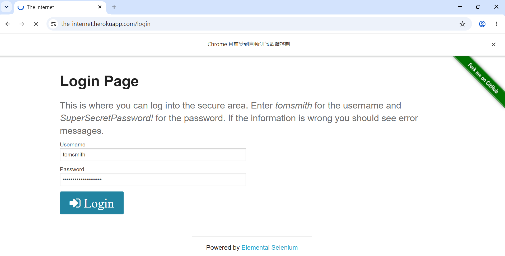
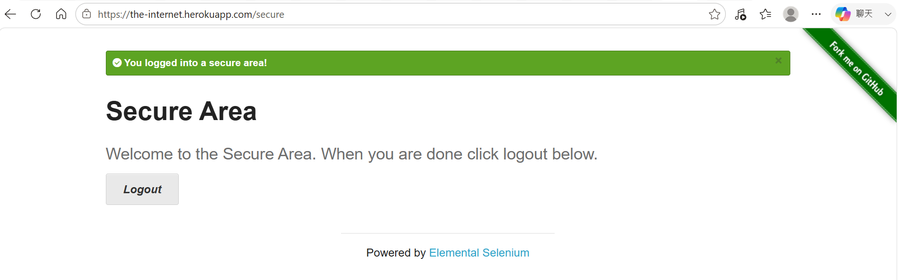
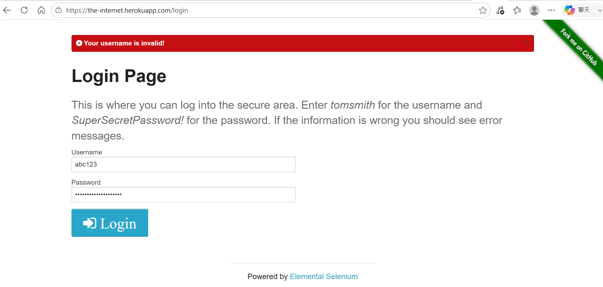

# Selenium Web Automation Testing

This project demonstrates web automation testing using **Python** and **Selenium WebDriver**. It covers login validation, form interaction, and button functionality testing, showcasing a complete web UI automation testing workflow.

---

## ✨ Features

✔ Login Automation Testing

✔ Form Validation Testing

✔ Button Interaction Testing

✔ Selenium WebDriver Automation

✔ Assertion Verification

✔ GitHub Ready

---

## 🛠 Technologies

- Python 3.13.9
- Selenium 4.46.0
- Chrome WebDriver
- Pytest
- Git
- GitHub

---

## 📂 Project Structure

```text
selenium-test/
│
├── screenshots/
├── tests/
├── requirements.txt
├── README.md
└── ...
```

---

## 🏗 Test Architecture

```text
Test Cases
      │
      ▼
Selenium WebDriver
      │
      ▼
Browser (Chrome)
      │
      ▼
Target Website
      │
      ▼
Assertions
      │
      ▼
Test Result
```

---

## 🔧 Installation

```bash
git clone https://github.com/balla930510-cmd/selenium-test.git

cd selenium-test

pip install -r requirements.txt
```

---

## 💻 Test Environment

| Item | Version |
|------|---------|
| Operating System | Windows 11 |
| Python | 3.13.9 |
| Selenium | 4.46.0 |
| Browser | Google Chrome 150|
| ChromeDriver | 150 |
## 🚀 Selenium Automation Testing

### Test Coverage

- Login Testing
- Form Testing
- Button Testing

---

## 📋 Test Cases

| Test Case | Description |
|-----------|-------------|
| TC001 | Login Success |
| TC002 | Invalid Username |
| TC003 | Invalid Password |
| TC004 | Form Submission |
| TC005 | Button Click |

---

## 🧪 Framework

- Selenium WebDriver
- Pytest
- Assertion Testing

---

## ▶ Run Tests

```bash
pytest
```

---

## ✅ Test Result Summary

| Item | Result |
|------|--------|
| Total Test Cases | 3 |
| Passed | 3 |
| Failed | 0 |
| Success Rate | 100% |

---

## 📸 Test Execution Results

### Button Test


---

### Form Test


---

### Login Test



---

## 🔍 Login Test Details

### TC001 – Login Success

**Expected Result**

User successfully logs into the system.



---

### TC002 – Invalid Username

**Expected Result**

Display the message:

> Your username is invalid!



---

### TC003 – Invalid Password

**Expected Result**

Display the message:

> Your password is invalid!


---

## 👨‍💻 Author

Bai, Chen-Liang

Department of Mathematics  
Information Mathematics Program

Fu Jen Catholic University

GitHub: https://github.com/balla930510-cmd

Email: balla930510@gmail.com

---

## 📄 License

This project is created for learning and portfolio purposes.

Copyright © 2026 Bai Chen-Liang. All rights reserved.